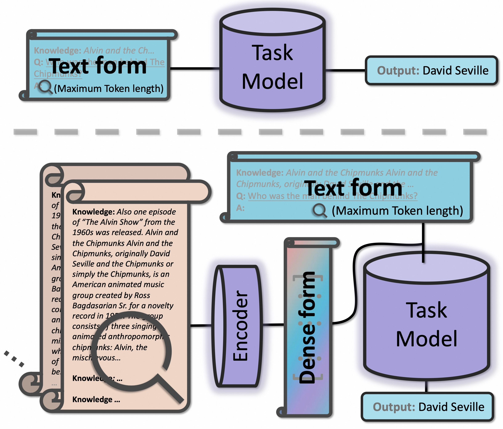

# Improving Retrieval Augmented Open-Domain Question-Answering with Vectorized Contexts
> Source code for paper [Improving Retrieval Augmented Open-Domain Question-Answering with Vectorized Contexts](https://arxiv.org/abs/2404.02022)



## Python Environment
```bash
conda create -n vec python=3.9
conda activate vec
pip install -r requirements.txt
```

## Training (E.g. on TriviaQA template dataset, 1gpu)
baseline
```bash
bash triviaqa-0vec.sh
```

(Encoder frozen) +5k & +10k
```bash
bash triviaqa-10vec.sh
bash triviaqa-20vec.sh
```

(Encoder training) +5k & +10k
```bash
bash triviaqa-10vec-enc-dec.sh
bash triviaqa-20vec-enc-dec.sh
```

## Evaluate (E.g. on TriviaQA dev. template dataset, 1gpu)
In top directory of this repo., you might need to modify the model path in `src/eval_triviaqa_em_online.py `.
```python
python src/eval_triviaqa_em_online.py 
```

## Note
1. Be careful of the version of `transformers` and `pytest`, and please follow the requirements listed in requirements.txt. 
2. Due to networking issues, some of the model in the code is loaded locally. Please adjust it into your way for loading.